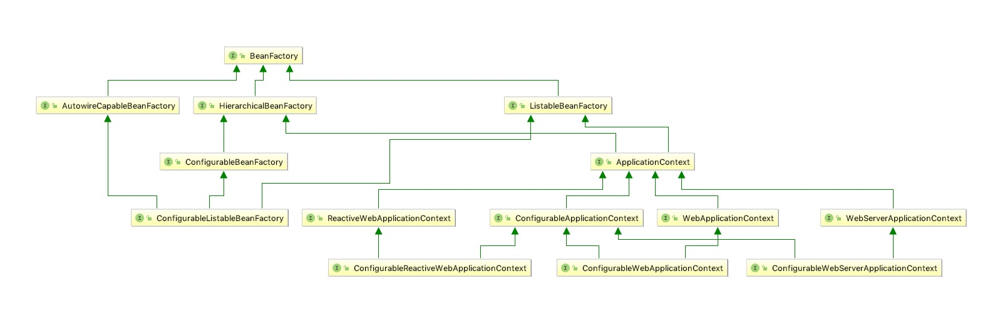
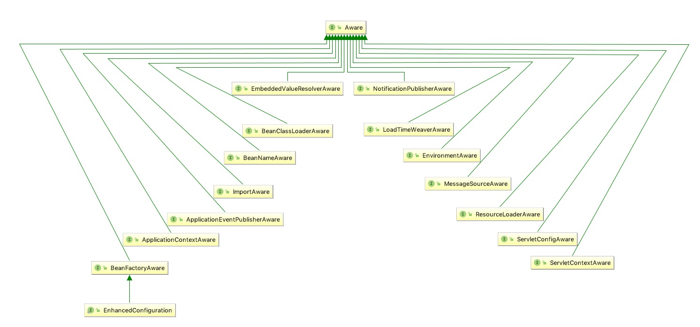

# 概览

```
BeanFactory应该支持Bean的生命周期，当前整个周期包括
1. BeanNameAware.setBeanName(String name)
2. BeanClassLoaderAware.setBeanClassLoader(ClassLoader clasLoader)
3. BeanFactoryAware.setBeanFactory()
4. EnvironmentAware.setEnvironment()
5. EmbededValueResolverAware.setEmbeddedValueResolver()
6. ResourceLoaderAware.setResourceLoader
7. ApplicationEventPublisherAware.setApplicationEventPublisher()
8. MessageSourceAware.setMessageSource()
9. ApplicationContextAware.setApplicationContext()
10. ServletContextAware.setServletContext()
11. BeanPostProcessors.postProcessBeforeInitialization()
12. InitializingBean.afterPropertiesSet()
13. a custom init-method definition
14. BeanPostProcessors.postProcessAfterInitialization
15. DestructionAwareBeanPostProcessors.postProcessBeforeDestruction
16. DisposableBean.destroy
17. a custom destroy-method definition
```

其中，BeanFactory是Bean加载的根类，他定义了Bean容器的基本能力，其继承结构如下:



同时，在实现每个步骤的过程中使用最多的就是Aware接口的实例，其实现实例如下:


## 1. setName